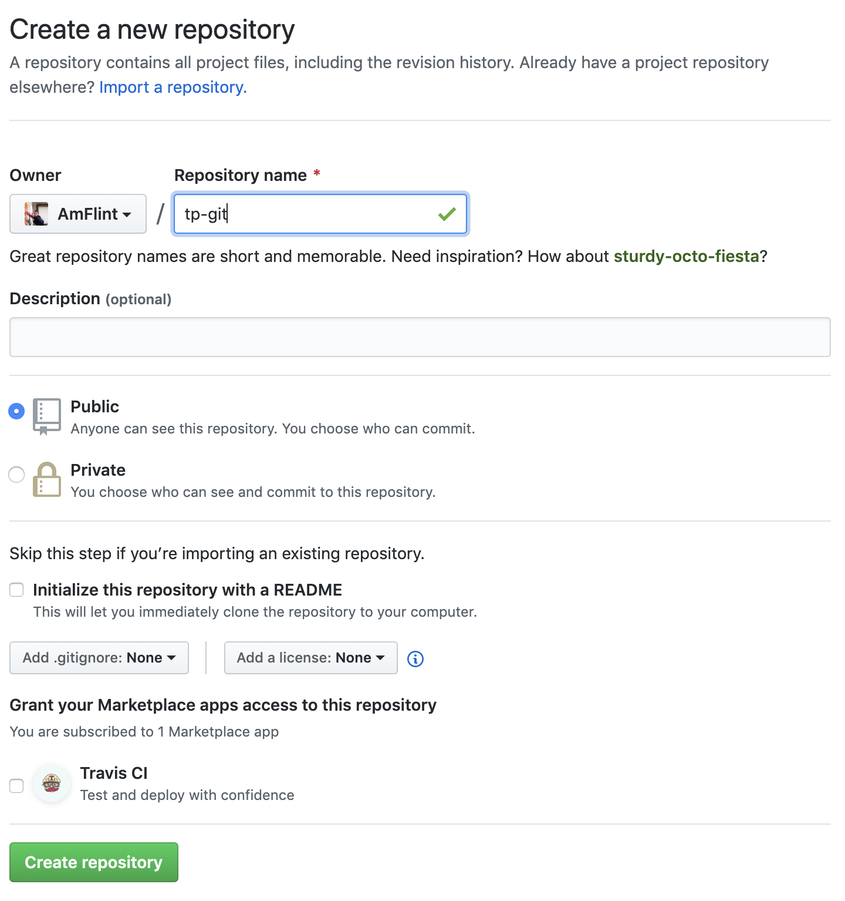
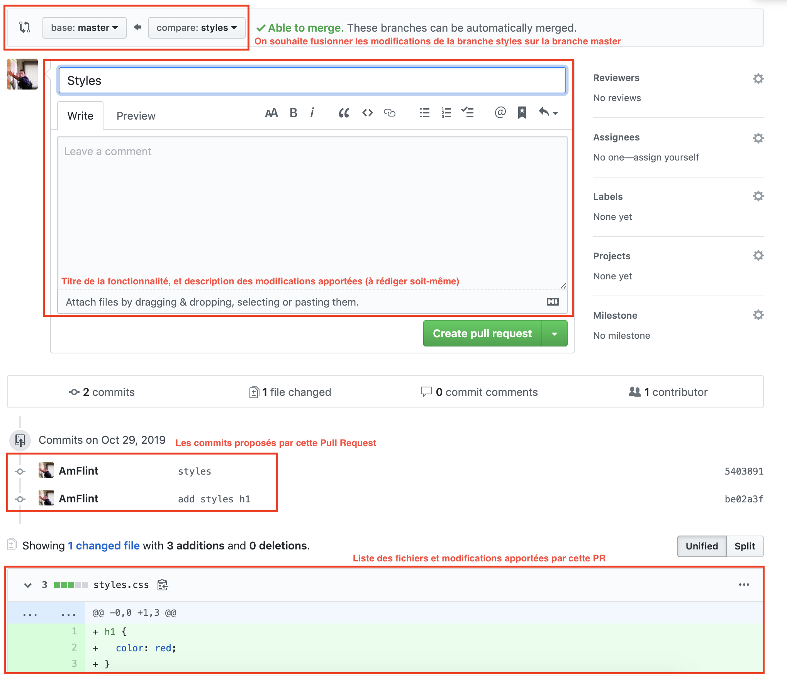
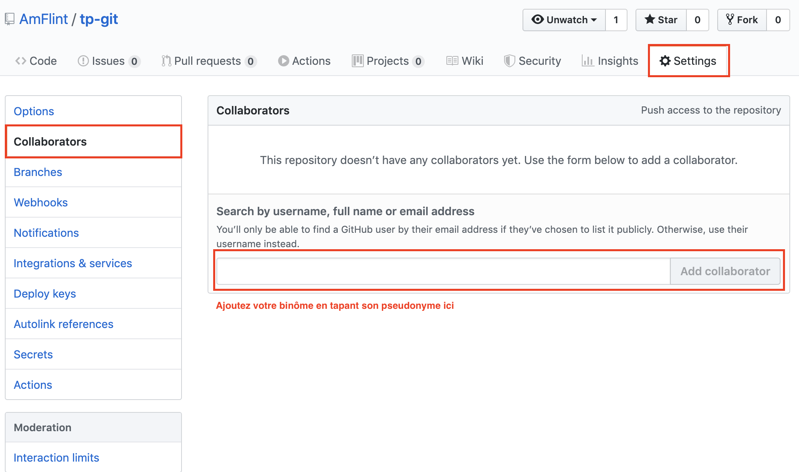
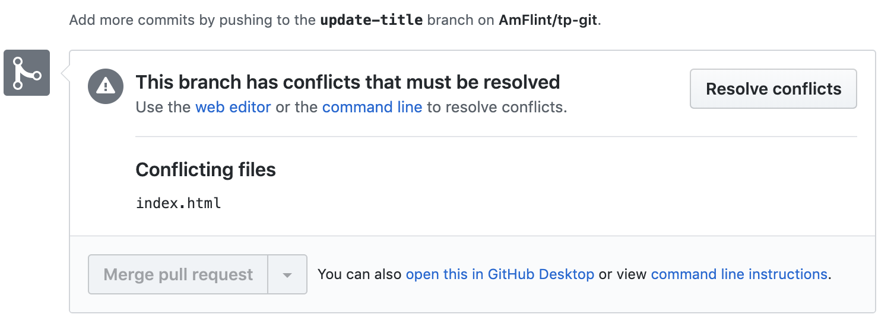

# Git

Cette thématique regroupe les TPs et supports pour le cours porté sur l'apprentissage de la technologie Git à travers la plateforme GitHub.

Git permet à une équipe de développeurs de travailler simultannément sur un même projet (et donc les mêmes fichiers) pour mettre en commun des fonctionnalités que chacun sera amené à développer.

Avec de simples commandes Shell, les développeurs pourront télécharger sur leur ordinateur le code stocké sur un serveur distant (ici, Github), ou mettre à jours le code du projet suite à l'ajout d'une nouvelle fonctionnalité.

Il existe également des fonctionnalités permettant aux développeurs de lire le code produit par d'autres développeurs avant de le fusionner sur la branche principale. Ce qui permet à un groupe de travailler ensemble, et d'assurer la qualité du travail fournis, et de retracer les fonctionnalités (et correction de bugs) grâce à un système de commits, qui laisse une trace de chaque modification apporté dans le code d'un projet.

## Git - le fonctionnement de base

Le workflow classique, en prenant l'exemple d'un déménagement, en 3 étapes:
- Descendre les cartons présent dans l'appartement A dans la rue, devant le camion de déménagement
- Monter les cartons posés dans la rue, à l'intérieur du camion
- Le camion part, et amène les différents cartons vers l'appartement B

Ici, l'appartement A fait référence à notre ordinateur, et l'appartement B au repository Github (serveur distant).

Git fonctionne en `3 étapes` également:
- `git add` pour descendre les cartons dans la rue (pour choisir quels fichiers seront envoyés)
- `git commit` pour porter les cartons de la rue, au camion avec des instructions (un message qui indique ce qui sera envoyé/les modifications et ajouts apportés par les différents fichiers).
- `git push` pour envoyer le camion vers l'appartement B (pour envoyer les modifications sauvées dans les `commit` au repository distant sur Github).

Ensuite, on pourra utiliser la commande `git pull` pour télécharger sur notre ordinateur les dernière modifications apportées sur le repository distant.

### TPs

Dans ce TP, nous allons créer un repository sur Github, le télécharger sur notre ordinateur et commencer à intéragir avec.

Pour cela nous pourrons:

- Connectez vous sur https://github.com
- Créez un nouveau repository, appelez-le `tp-git`:
  
- Récupérez le lien de **votre** repository, comme dans la figure ci-dessous:
  
- Clonez le repository quelque part dans votre système de fichier:
  - Ouvrez un terminal
  - Déplacez vous avec la commande `cd` pour vous placer où vous le souhaitez
  - Utilisez la commande `git clone` avec le lien copié dans l'étape précédente pour télécharger le repository sur votre ordinateur. Par exemple dans mon cas sur cet exemple:
  ```bash
  git clone https://github.com/AmFlint/tp-git.git
  # Résultat de la commande
  Cloning into 'tp-git'...
  warning: You appear to have cloned an empty repository.
  # Vous venez de télécharger votre repository Github sur votre ordinateur, dans un dossier "tp-git"
  # Si j'utitlise la commande ls, je peux voir le dossier tp-git
  ls
  tp-git
  ```
  - Placez vous dans votre dossier `tp-git` fraîchement téléchargé avec la commande `cd`. Vous allez pouvoir créer vos fichiers et sauvegarder vos premières modifications.
  - Pour commencer à `coder`, je vous invite à ouvrir ce dossier `tp-git` dans votre éditeur de texte. 

**Pour la suite des instructions, veuillez vous placer dans le dossier tp-git avec la commande cd dans votre terminal**

- Créez un fichier `index.html`, ajoutez la structure de base (Doctype...), et un `h1` comprenant la phrase `Hello git`. Sauvegardez votre fichier.
- Retournez dans votre terminal, c'est le moment de découvrir la commande `git status`, qui permet de voir les différentes modifications en cours, et leur état (tracked/untracked, added/not added). Vous devriez voir le fichier `index.html` afficher en rouge en résultat de cette commande. Cela veut dire qu'une modification a été apportée dans ce fichier, mais qu'il n'est pas pris en compte par git actuellement. Si on revient à l'exemple du déménagement, le carton `index.html` est dans l'appartement A, il va falloir le descendre dans la rue pour le déménager.
- Vous pouvez `ajouter` (`git add`) ce fichier au staging de git, pour qu'il soit pris en compte lors du prochain `git commit`. On parle ici de descendre le carton index.html dans la rue. Utilisez la commande `git add` pour ajouter le fichier.
- Si vous relancez la commande `git status`, vous verrez que le fichier `index.html` s'affiche en vert cette fois-ci: Il sera pris en compte par `git` lors de la commande `git commit` (le carton `index.html` est dans la rue, devant le camion de déménagement).
- À présent, nous allons créer notre premier commit:
  ```bash
  # On utilise l'option -m pour indiquer un message lié aux modifications effectuées
  git commit -m "Ajout fichier HTML et structure de base, avec un titre"
  ```
  Ici, on prend le carton `index.html`, et on le pose dans le camion, prêt à être déménagé, et on donne des instructions aux déménageur (le message de commit).
- Nous pouvons maintenant envoyer les fichiers commités vers le serveur distant (déplacer le camion de l'appartement A vers l'appartement B, avec les cartons placés à l'intérieur): `git push`:
  ```bash
  git push
  # Résultat de la commande
  Enumerating objects: 3, done.
  Counting objects: 100% (3/3), done.
  Writing objects: 100% (3/3), 214 bytes | 214.00 KiB/s, done.
  Total 3 (delta 0), reused 0 (delta 0)
  To github.com:AmFlint/tp-git.git
  * [new branch]      master -> master
  ```
  Nous venons de push nos premiers fichiers ! 
- Allez sur votre repository Github, vous devriez voir votre fichier index.html


Pour la suite de cet exercice, je vous invite à répéter les étapes vues au-dessus pour:
- Ajouter un fichier `styles.css` avec l'instruction suivante:
  ```css
  h1 {
    color: red;
  }
  ```
- Importez votre fichier de `style` dans votre fichier `index.html` (<link rel="stylesheet" ... /> )
- Créez un premier commit contenant le fichier `styles.css` (git add puis git commit en sélectionnant uniquement le fichier styles.css)
- Envoyez les modifications à votre repository distant avec `git push`
- Faites de-même pour envoyer votre fichier `index.html` mis à jours (avec l'import du fichier de style) sur votre repository distant

Si vous avez bien suivi les étapes, vous devriez avoir 3 commits:
- Le premier avec le fichier index.html
- Le second avec le fichier styles et la couleur rouge sur les éléments h1
- Le troisième avec le fichier index.html modifié avec l'import de la feuille de styles.

À présent, vous devriez comprendre le fonctionnement de base de `git`, pour envoyer des fichiers de votre ordinateur local vers un repository distant.

## Les branches

Précédemment, nous avons vu comment intéragir avec un repository distant à travers le workflow fondamental de git.

Maintenant nous allons voir comment travailler **ENSEMBLE** sur un même repository grâce à un système de `branche`. Ce système nous permet de travailler sur une version spécifique du projet, pour ajouter nos fonctionnalités sur cet environnement, sans être dérangé par les modifications apportées par les autres développeurs.

Par la suite, nous pourrons envoyer le code sur le repo distant sur cette même branche, pour proposer une mise à jours du code du projet, que nos collègues développeurs pourront relire, et tester de façon indépendantes les unes des autres, avant de fusionner les modifications apportées sur une branche, vers la branche principale (`master`).

Pour créer une branche, on utilise la commande `git checkout`, qui permet de changer la branche que nous utilisons actuellement sur notre ordinateur.
L'option `-b` permet de préciser que nous souhaitons créer une nouvelle branche avec un nom spécifique passé en argument.
Par exemple:
```bash
# git checkout pour indiquer que l'on souhaite "changer de branche"
# -b pour indiquer que l'on souhaite créer une nouvelle branche
# ici, nom-de-la-nouvelle-branche est le nom que l'on va attribuer à la branche que l'on souhaite créer.
git checkout -b nom-de-la-nouvelle-branche
```

**Notez que lorsqu'on utilise la commande git checkout -b, git va créer une nouvelle branche sur notre ordinateur en partant de la branche sur laquelle on se trouve au moment de lancer la commande**, et va donc "dupliquer" le code dans l'état dans lequel il se trouve au moment du git checkout.

Une fois la branche créer, on peut vérifier sur quelle branche l'on se trouve avec la commande suivate:
```bash
# git branch affiche une liste des différentes branches qui existent sur le repository
# La branche sur laquelle on se trouve est pré-fixé d'un "*"
git branch
# Résultat de la commande
* nom-de-la-nouvelle-branche
master
```

Si vous utilez `Git Bash` sur Windows ou avez installé `Oh My Zsh` sur MacOS, le nom de la branche est affiché par défaut dans votre terminal comme par exemple:
```bash
# Je suis dans un dossier "terminal", sur la branche master
# Ici, mon terminal m'indique clairement la présence d'un repository git
➜  terminal git:(master) 
```

On peut à présent appliquer notre workflow classique vu au-dessus sur notre nouvelle branche:
- `git checkout -b` pour créer une nouvelle branche et la choisir sur notre ordinateur
- `git add` pour ajouter les fichiers à commit
- `git commit` pour créer un commit avec les modifications apportées
- `git push` pour envoyer le code sur la branche sur laquelle on se trouve.

En général, on va utiliser une branche pour développer une fonctionnalité complète sans être dérangé par les modifications des autres développeurs, on pourra ensuite utiliser `une Pull Request` pour proposer de fusionner ces modifications sur une autre branche.

C'est très utile pour ajouter une fonctionnalité complète sur la branche `master` après avoir passé une relecture de la part des autres développeurs.

Une fois le code `poussé` sur notre nouvelle branche, il va falloir se diriger sur notre repository sur Github pour ouvrir une Pull Request:

Ici, on voit que je peux ouvrir une `Pull Request` (demande de fusion) depuis une branche appelée `styles` (on peut donc supposer que j'ai ajouté/modifié des styles sur cette branche).


Ici, on retrouve les différentes informations principales d'une Pull Request à savoir:
- La branche `source` et la `destination` (quelle branche souhaite t-on merger vers quelle branche)
- Titre et description de la PR. On va rédiger un titre concis qui résume en quelques termes la fonctionnalité apportée par cette Pull Request. on utilise la partie `Leave a comment` pour rédiger avec plus de détails.
- La liste des commits compris dans cette `Pull Request` (et quel utilisateur les propose).
- La liste des fichiers ainsi que les modifications apportées par cette MR, très utile pour relire son travail.


Ici, on retrouve les différentes informations concernant la Pull Request. Il nous suffit de cliquer sur le bouton `Merge pull request` pour ajouter les modifications apportées sur cette branche vers la branche `master`.

### TP

#### Première Partie

Maintenant, il est temps de mettre ce concept de branches en pratique. Veuillez reprendre votre repository utilisé précédemment.

Pour cet exercice, vous devrez simplement `ajouter une fonctionnalité`, à savoir: `Ajouter un sous-titre (h2) en couleur vert. Le sous-titre sera: "Les Pulls Requests"`.

Dans cet exercice vous devrez donc:
- Modifier le fichier index.html, pour ajouter un élément `h2` avec la phrase donnée au-dessus.
- Modifier le fichier `styles.css` pour ajouter du style sur l'élément h2 (`color: green`).
- Créer une nouvelle branche, que vous appellerez `add-subtitle`
- Ajouter **2 commits bien distincts** (il est important de séparer les commits, pour faciliter la lecture du code aux autres développeurs):
  - Le premier commit contiendra le fichier `index.html` avec les modifications apportées sur le `h2`
  - Le second commit contiendra le fichier `styles.css`
- Pousser le code sur la nouvelle branche du repository `GitHub`, puis il faudra ouvrir une `Pull Request` vers la branche master.
- Merger la fonctionnalité

Si vous êtes en avance, vous pouvez répéter l'opération avec une autre fonctionnalité: `Ajouter un paragraphe avec la couleur bleue`.

**N'oubliez pas de vous remettre sur la branche master et de `git pull` pour récupérer en local les dernière modifications fusionnées depuis les PRs**:
```bash
# git checkout sans option permet de changer de branche, sans en créer une
# Ici, on peut donc changer de branche pour se diriger sur la branche "master", la branche principale de notre projet
git checkout master
# Ensuite, on va récupérer les modifications apportées par la PR avec la commande git pull
git pull
```

#### Seconde Partie

Pour cette seconde partie, vous vous mettrez par deux, pour simuler un vrai cadre de travail en équipe.

Choisissez le repository de l'un d'entre vous pour travailler ensemble sur le même, la deuxième personne devra donc `git clone` le repository en local, et la première devra donner les droits de participer à la seconde (**Sur votre repository**):


Le/La premier(e) développeur(se):
- Modifier le fichier `index.html`, changer le h1: "Travailler en collaboration :D"
- Modifier le fichier `styles.css` pour modifier la couleur du h1: `fuchsia`
- Envoyer le tout sur une nouvelle branche, puis ouvrez une Pull Request.

Le/la second(e) développeur(se):
- Modifier le fichier `index.html`: Modifier le h2: `Les Pulls Requests en équipe`
- Modifier le fichier `styles.css` pour modifier la couleur du h1: `pink`
- Envoyer le tout sur une nouvelle branche (**Une branche différente de celle utilisée par votre binome**).

Maintenant, vous allez pouvoir fusionner 2 fonctionnalités développées en même temps, sur les mêmes fichiers par deux personnes différentes, très simplement.

La première PR que vous mergerez sera fusionnée sans problème, par contre, la seconde rencontrera des `conflits`. Lorsque une même ligne d'un fichier est modifiée en même temps sur deux branches différentes, `git` ne sait pas qui a raison. **Ici, chacun des membres du binome a modifié le couleur du h1 dans le fichier styles.css**, git ne sait pas quelle modification doit être utilisée, et indique donc un `conflit` que les développeurs vont devoir gérer manuellement.


Dans la figure ci-dessus, on voit que GitHub nous averti qu'un conflit a été détecté (Dans cet exemple il s'agit du fichier `index.html` comme indiqué ci-dessus, mais dans votre TP, il doit s'agir du fichier `styles.css`).

Pour résoudre ce conflit: l'un d'entre vous doit ouvrir son terminal pour `pull les dernière modifications de la branche master`, régler le conflit puis `push à nouveau les modifications`:
```bash
# Je peux préciser les arguments "origin <nom-de-branche>" pour indiquer à git que je souhaite pull les dernière modifications de la branche "master"
➜ tp-git git:(update-title) git pull origin master
remote: Enumerating objects: 1, done.
remote: Counting objects: 100% (1/1), done.
remote: Total 1 (delta 0), reused 0 (delta 0), pack-reused 0
Unpacking objects: 100% (1/1), done.
From github.com:AmFlint/tp-git
 * branch            master     -> FETCH_HEAD
   3675f4f..658c464  master     -> origin/master
Auto-merging index.html
CONFLICT (content): Merge conflict in index.html
Automatic merge failed; fix conflicts and then commit the result.
```
Ici, vous voyez dans mon cas, git m'indique que le fichier `index.html` comprend un conflit que je dois régler manuellement (**Il doit s'agir de styles.css pour votre TP**).

Dirigez vous dans votre éditeur de texte, vous devriez obtenir quelque chose ressemblant à ça:
```css
h1 {
<<<<<<< HEAD
  color: fuchsia;
=======
  color: pink;
>>>>>>> 658c4647823e4e37ecfe03ad8190dedae19a7305
}
```
Ici, Git vous indique les différences qui ont été apportées en même temps sur la même ligne, entre des `marqueurs de conflits` (<<<<, =======, et >>>>>>).

Vous devrez maintenant choisir quelle modification vous souhaitez conservé (`choisissez le pink`). **Vous pouvez ensutie supprimer les lignes comprenant des marqueurs de conflits, ainsi que l'une des lignes de color, pour n'en conserver qu'une seule**.

Une fois fait, vous pouvez simplement `git add`, `git commit` + `git push`.

Rendez-vous sur votre Pull Request sur GitHub, le conflit est à présent réglé et vous pouvez merger vos modifications !

